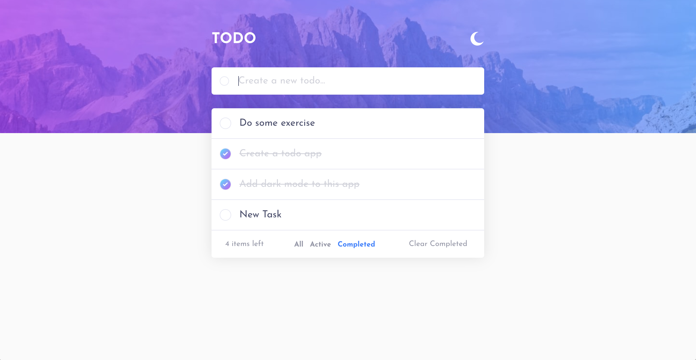
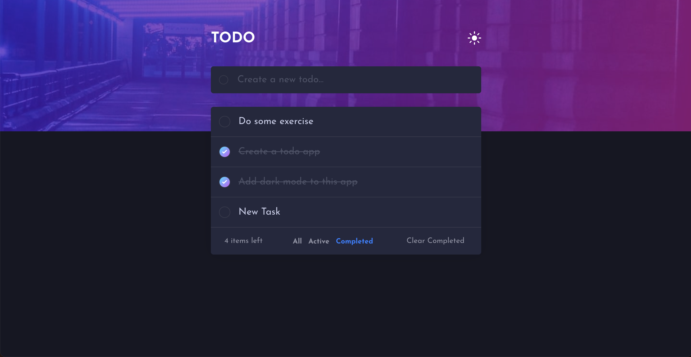

# Todo App

A responsive todo application built with React and TypeScript as a solution to the [Frontend Mentor Todo app challenge](https://www.frontendmentor.io/challenges/todo-app-Su1_KokOW).

The app focuses on clean state management, persistent user preferences, responsive styling, and an accessible task workflow.

## Live Demo

- [Live site](https://react-todo-app-ashkan.netlify.app/)
- [Frontend Mentor solution](https://www.frontendmentor.io/solutions/todo-app-with-react-js-tH5Wbrk27s)

## Screenshots





## Features

- Add new todos
- Mark todos as complete or active
- Delete individual todos
- Filter todos by all, active, or completed
- Clear completed todos
- Show the number of active todos left
- Persist todos in `localStorage`
- Persist light/dark theme preference in `localStorage`
- Responsive layout for mobile and desktop screens
- Hover and active states for interactive elements

## Built With

- React
- TypeScript
- CSS Modules
- React Context API
- `localStorage`
- Create React App

## Getting Started

### Prerequisites

- Node.js
- npm

### Installation

```bash
npm install
```

### Run Locally

```bash
npm start
```

The app will run at `http://localhost:3000`.

### Build

```bash
npm run build
```

### Type Check

```bash
npx tsc --noEmit
```

## What I Practiced

- Managing shared state with React Context
- Keeping derived UI state in sync with source data
- Persisting application state after React state updates
- Typing component props and state with TypeScript
- Building a responsive layout with CSS Modules
- Improving UI behavior for empty and filtered todo states

## Notes

This project was built as a portfolio exercise. Create React App is used here because the project started from a CRA setup; for a new production React project, I would consider Vite or a framework such as Next.js depending on the requirements.
